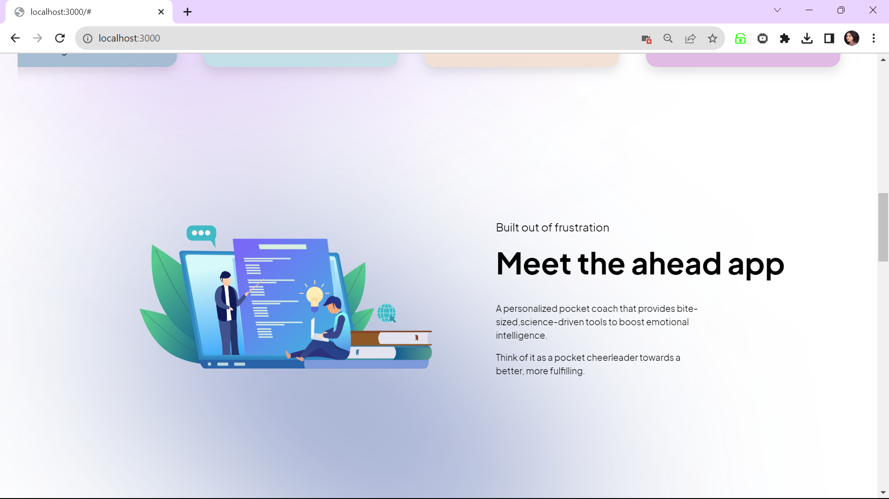

# Ahead App (Dribbble Mockup Redesign Concept)
## Next.js, TailwindCSS, and Framer Motion Implementation

In this project, the front-end implementation of the "Ahead App - Mockup by Taras Migulko," is done as originally featured on Dribbble(https://dribbble.com/shots/19807069-Ahead-app-redesign-concept). This modern, responsive web application is built with Next.js, TailwindCSS, and JavaScript, and enhanced with Framer Motion for smooth and engaging animations. A modern responsive web application.

### Overview
The Ahead App redesign is a concept that focuses on delivering a sleek, user-friendly interface with an emphasis on interactivity and responsiveness. This implementation aims to bring the concept to life, leveraging the power of Next.js for server-side rendering and TailwindCSS for a utility-first approach to styling.

### Features
* Next.js Framework: Enhances performance, SEO, and server-side rendering.
* Tailwind CSS: Implements a custom, responsive design rapidly.
* JavaScript: Ensures dynamic interactivity and seamless user experiences.
* Framer Motion: Adds sophisticated animation effects, enhancing UX.
* Responsive Design: Looks great on mobile, tablet, and desktop screens.
* Modern UI/UX (Figma): Focuses on clean design and usability.

### Technologies Used
- Next.js
- TailwindCSS
- JavaScript
- Framer Motion

