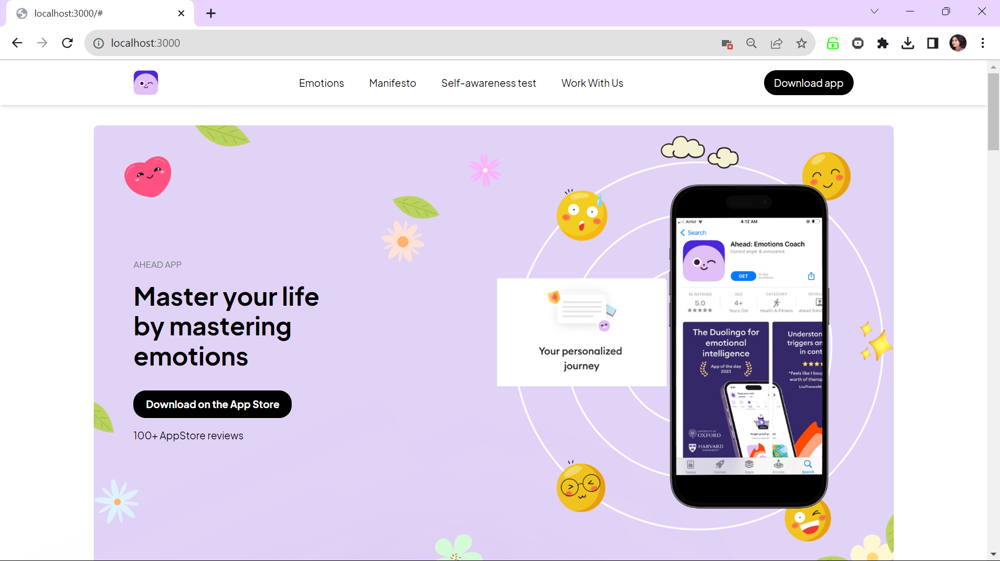
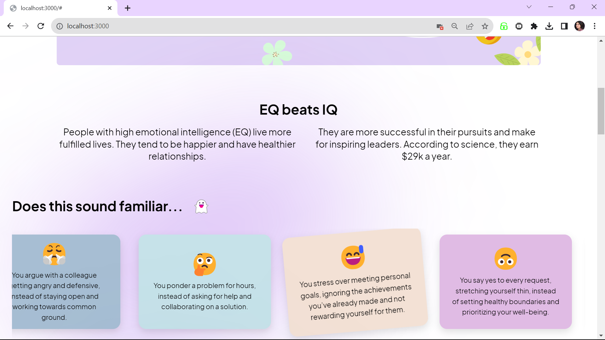
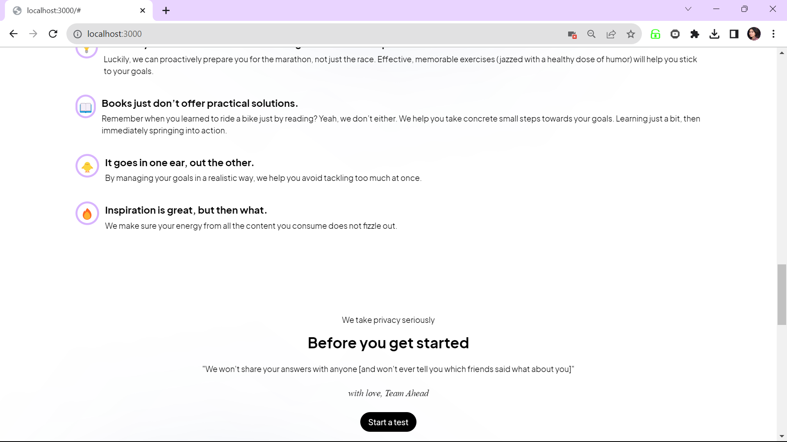
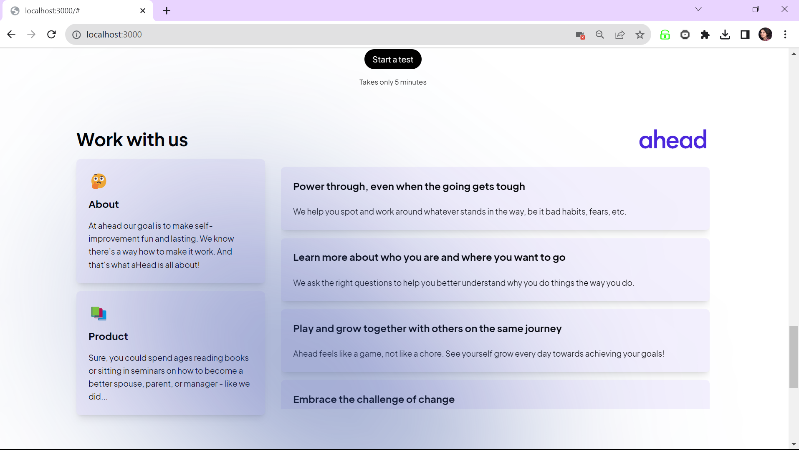
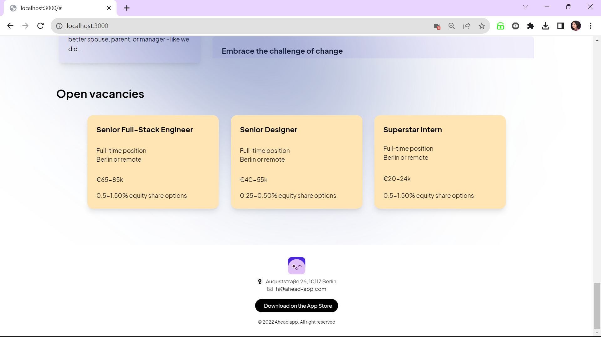

Ahead App (dribbble mockup redesign concept) - Next.js,TailwindCSS and Framer motion Implementation

In this project i have implemented the front-end the "Ahead App - mockup by Taras Migulko" originally featured on Dribbble(https://dribbble.com/shots/19807069-Ahead-app-redesign-concept).I have Demonstrated a modern responsive web application built with Next.js, TailwindCSS, JavaScript, and enhanced with Framer Motion for smooth and engaging animations. Below are the attached results from the implementation.

Overview
The Ahead App redesign is a concept that focuses on delivering a sleek, user-friendly interface with an emphasis on interactivity and responsiveness. This implementation aims to bring the concept to life, leveraging the power of Next.js for server-side rendering and TailwindCSS for a utility-first approach to styling.
!
Features
Next.js Framework: Utilizing the robust features of Next.js for enhanced performance, SEO, and server-side rendering.
TailwindCSS: For implementing a custom, responsive design with the utility-first CSS framework for rapid UI development.
JavaScript: For ensuring dynamic interactivity and seamless user experiences.
Framer Motion: For adding sophisticated animation effects to enhance UX, making the interface more intuitive and visually appealing.
Responsive Design: Fully responsive layout that looks great on both mobile,tablet and desktop screens.
Modern UI/UX(figma): for clean design and usability. 
[Alt text](image-2.png)
Technologies Used
Next.js
TailwindCSS
JavaScript
Framer Motion

